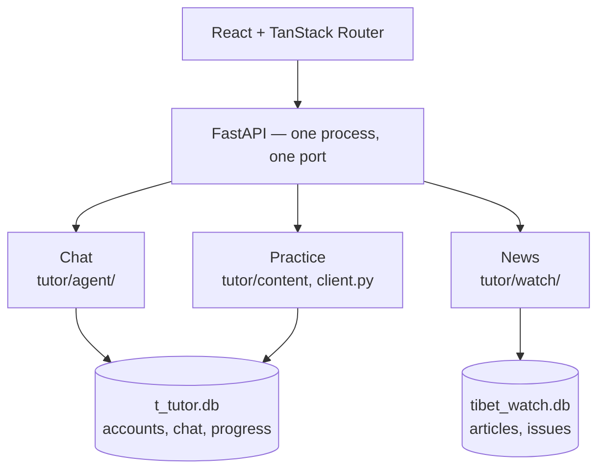
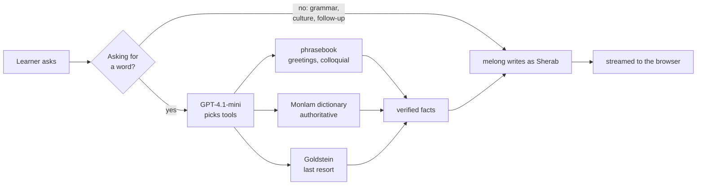
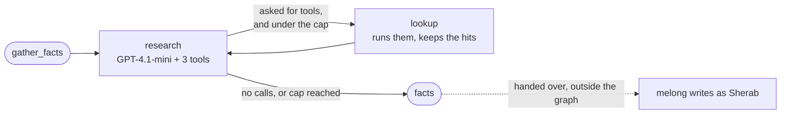
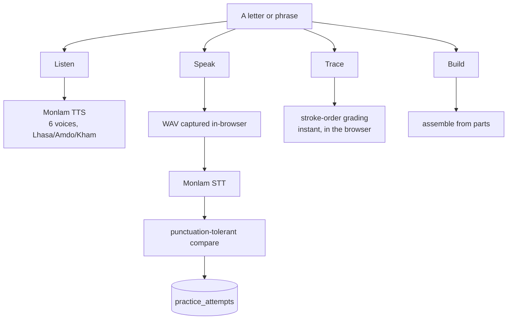
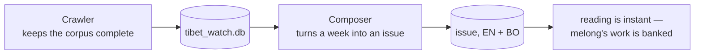
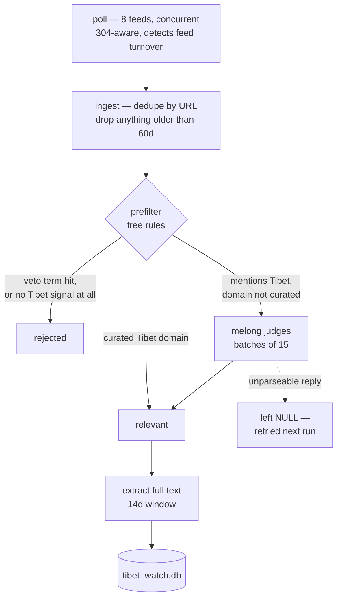
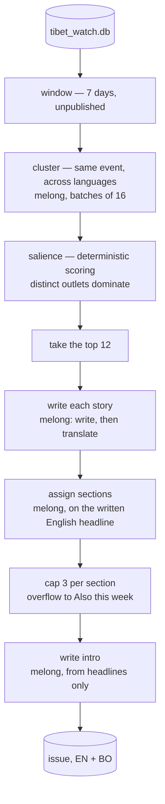

# MunSel

A Tibetan language app built on [Monlam AI](https://api-v1.monlamai.studio/docs).
Three products in one FastAPI process, sharing a database, an account and a
level.

| | What it does | What it runs on |
|---|---|---|
| **Chat** | Sherab, a tutor that looks vocabulary up before it teaches | GPT-4.1-mini orchestrates, melong writes |
| **Practice** | Alphabet and phrase drills — hear it, say it, write it | Monlam TTS and STT, with instant stroke grading |
| **Newsroom** | A bilingual Tibet digest — crawled, screened, ranked and written | RSS + melong via LangChain |



Two databases on purpose: one holds irreplaceable user data, the other is a
cache the crawler can rebuild, and a crawl holds the SQLite writer for minutes
at a time.

## Monlam AI, end to end

MunSel uses **every service the Monlam API offers**, each where it is the best
tool for the job rather than for the sake of a checklist.

| Monlam service | Where it works in MunSel |
|---|---|
| **melong** — chat, streaming and batch | Sherab's entire teaching voice; and in the newsroom: screening borderline articles, clustering events across languages, writing every story, translating EN ⇄ BO, filing sections, writing the issue intro |
| **Text-to-speech** — 6 voices, Lhasa/Amdo/Kham | The Listen drill, so a learner hears a letter or phrase in a real dialect |
| **Speech-to-text** | The Speak drill, grading pronunciation against the target |
| **OCR** | Building the Goldstein dictionary from a scanned PDF into a lookup source |
| **Dictionary** | The tutor's authoritative vocabulary lookup, EN ⇄ BO |

melong carries the most weight. It writes every Tibetan sentence a learner
reads, in both products — and in the newsroom it does the work no rule could:
recognising that an English report and a Tibetan report describe the same
earthquake, and producing publishable bilingual prose from a week of raw
reporting.

## Running it locally

Needs Python 3.11+ and Node 22.

```bash
cp .env.example .env          # then fill in MONLAMAI_STUDIO and OPENAI_API_KEY

pip install -r t_tutor/requirements.txt
cd web && npm install
```

Two terminals, because the frontend wants hot reload:

```bash
cd t_tutor && python -m uvicorn app:app --reload --port 8080
cd web && npm run dev          # http://localhost:5173, proxies /api to :8080
```

Or the way production runs it — one port, no Node:

```bash
cd web && npm run build
cd t_tutor && python -m uvicorn app:app --port 8080   # http://localhost:8080
```

---

## Chat — Sherab, a tutor that looks things up

The tutor is called **Sherab**, and melong writes everything he says.

Melong is what makes Sherab worth talking to. It writes Tibetan with a fluency
and a cultural register no general model matches, and every sentence a learner
reads is its work — the explanations, the examples, the encouragement, the
pacing for a beginner.

What it should not be asked to do is serve as a database. Asked "how do you say
hello" during development it produced five different answers, and once answered
"thank you" with the greeting — the ordinary recall problem every generative
model has, and a serious one when a beginner cannot tell a right answer from a
wrong one.

So the architecture plays to its strength and covers the gap. A cheap
orchestrator looks the vocabulary up in real sources first, and hands melong
verified words to teach with. Melong is freed from remembering and left to do
what it is best at. **The model that writes Tibetan is given the Tibetan that
is true.**



**The gate is deterministic, not model-decided.** Left to the orchestrator, a
question about grammar rules had it looking up the *words* "grammar" and
"unique" and teaching them as vocabulary; "what did you just teach me?" ran a
reverse lookup that returned an unrelated place name and overwrote a correct
pronunciation. A whitelist of phrasings that genuinely request a word is more
reliable than asking a model to judge its own confidence.

**Three sources, in priority order.** The phrasebook is 20 curated phrases and
6 colloquial words, and it exists because the Monlam dictionary returns
*nothing at all* for "hello" or "how are you", and literary register for
everyday adjectives — "beautiful" comes back as `བཀྲ་བ` ("shining,
variegated") where a beginner needed `མཛེས་པོ།`. The dictionary is
authoritative and free, ~250 ms. Goldstein is an OCR'd scan used only when both
miss, and labelled unreliable so the tutor hedges rather than asserts.

### The research graph

The research step is a LangGraph with two nodes and one cycle.



`research` asks GPT-4.1-mini what to look up; `lookup` runs whatever it asked
for and appends the results. The only exit is `_next`: the loop continues while
the model is still calling tools and `steps < MAX_RESEARCH_STEPS` (3). The cap
is a guard, not a tuning knob — a model that keeps calling tools would
otherwise spin until something else broke.

Failed lookups never leave the graph. A miss stays in the orchestrator's
transcript so it can react and try another tool, but only hits become facts, so
melong can never quote a failure as though it were an answer.

**This is why LangGraph rather than a prebuilt agent.** A stock ReAct executor
loops *and then writes the final answer with the same model* — which would
force one of the two things this design exists to avoid: either GPT-4.1-mini
writes the tutoring, losing melong's Tibetan fluency and cultural framing, or
melong sits inside the loop where its own output re-enters as evidence. A graph
can stop at the boundary and hand its result to a different model.

| | Model | Job |
|---|---|---|
| Inside the graph | GPT-4.1-mini | decide what to look up, gather facts |
| Outside the graph | melong | write the reply from those facts |

If the graph throws, `gather_facts` returns an empty list and melong still
answers — just without verified vocabulary. Research is a layer on top of a
tutor that works without it, not a dependency that can take the chat down.
`TUTOR_AGENT=0` removes the layer entirely, which is a fast way to see why it
is there.

`tutor/agent/` · orchestration `loop.py`, tools `tools.py`, generation `voice.py`

---

## Practice — hear it, say it, write it

Levels 1–5 decide which items appear. Each drill closes a different loop, and
they use different machinery.



**Speak needs its transcript normalised.** Monlam STT returns the right letters
with punctuation the speaker never said — `ཀ` comes back as `ཀ།`, `ང` as
`ང་།`. Comparing raw strings marks every correct answer wrong. Saying a
consonant aloud also produces a trailing vowel, so `ཀ` transcribes as `ཀའ` —
correct pronunciation that a naive match rejects. `tutor/normalize.py` forgives
an appended a-chung, but only when appended: stripping `འ` outright would erase
the twenty-third consonant, which is a practice item in its own right.

**Audio is captured as WAV, not the browser default.** `MediaRecorder` produces
webm/Opus; every verified STT call used WAV. The frontend collects raw PCM
through an `AudioContext` and encodes WAV itself.

**Trace is graded in the browser, stroke by stroke.** Writing the right shape
in the wrong order or direction is caught and named, which whole-shape
comparison cannot do. Glyphs without authored stroke data fall back to a
coverage check. No round trip, so feedback is immediate.

`tutor/content.py` items · `tutor/client.py` TTS/STT · `web/src/lib/stroke-grader.ts`

---

## Agentic Newsroom — a weekly digest nobody writes

The News tab. Nobody edits it: a crawler keeps a corpus of Tibet reporting
complete, and a composer turns a week of that corpus into a bilingual issue —
clustered, ranked, filed into sections and written in English and Tibetan.

Two halves, deliberately separate, because they answer different questions.
The crawler asks *is this one article about Tibet* — cheap, per-item, and it
has to happen at ingest time or the corpus fills with noise. The composer asks
*what were the ten stories of this week* — only answerable once a week of
corpus exists.



Every word of an issue is melong's, produced once during the run and banked in
SQLite. So a reader gets the full bilingual digest instantly, and it stays
readable even while melong is busy composing the next one.

### The crawler — completeness is the job



**RSS is a sliding window, not an archive.** CTA turns its entire feed over in
about 2.2 days, so a daily poll would lose stories permanently. Polling also
watches for turnover: if none of a feed's items were in the previous poll, the
feed rolled over completely and something may have been missed — the only
warning that catches a poll interval which has quietly become too slow.

**Ingest refuses to filter on recency.** A feed can be healthy and have nothing
for a week, and filtering at ingest would throw away exactly what an outage
cost. The 60-day bound is a guard against feeds republishing their archive, not
a relevance window.

**Screening is two-stage because the stages cost differently.** The free rules
resolve almost everything, and the order matters: veto terms are checked
*before* the domain check, so a curated outlet writing about an out-of-scope
topic is still rejected — being trusted does not grant a pass on everything you
publish. The default is also deny: no Tibet signal means out, not unsure, or
every unrecognised item would reach the model and the cheap filter would stop
being cheap.

**melong is spent on the calls that actually decide something.** The rules
settle what is already settled — a curated Tibet outlet needs no adjudication —
so every judge call is a genuinely ambiguous item: *mentions Tibet, publisher
unknown*, which is exactly the case no rule can resolve and open search results
produce constantly. Fifteen at a time in one call, which melong's 32k context
makes possible, and it sees a title, a source and 220 characters of snippet
rather than the article: screening happens *before* extraction, so melong is
deciding what is worth downloading before anything is downloaded.

The reply is a JSON array rather than a bare yes/no, one object per item
carrying the batch index, the verdict, a confidence and a reason. The index is
what makes batching safe: answers are re-keyed by it rather than trusted to
arrive in order. Anything unparseable is omitted rather than defaulted, so a
malformed reply leaves the item unscreened for the next run instead of silently
deleting it from the corpus.

`crawler.py` poll/ingest/extract · `relevance.py` prefilter and judge

### The composer — melong writes the issue



**Clustering groups events, not topics.** Two reports of one protest are one
story; two different protests are two stories. It runs across languages on
purpose — an English and a Tibetan report of the same earthquake must collapse
into one. It is batched at 16 because asking for one partition of all 49
articles made melong loop. If nothing at all gets grouped across 10+ articles
the run says so loudly, since a silent collapse to all-singletons looks exactly
like a legitimate week of unrelated news.

**Ranking is arithmetic, so melong's calls go to the language work.** Which
outlets covered a story is already countable — independent newsrooms choosing
the same event is the closest thing to editorial consensus you can measure
directly, and asking a model to re-derive it would spend context on something
addition already answers. Article count deliberately counts for very little, or
one organisation posting six updates about its own tour outranks a disaster.
The budget it frees goes where only melong can work: writing and translating
every story in the issue.

**Stories are written before they are filed.** Sectioning from the raw first
article's title meant classifying Tibetan-script headlines, and it filed a
5.8-magnitude earthquake under "Human rights & detentions". The written English
headline is a far better thing to classify, and it exists by then anyway. A cap
of three per section then pushes overflow to "Also this week", so one busy
topic cannot become the whole issue.

**Each story is written in its source language, then translated** — the primary
article's language decides — so compression loss and translation loss are not
stacked on top of each other. Headlines are translated too: a bilingual summary
under a headline half the readership cannot read is a strange thing to send.

**The intro is not a summary.** It sees only the finished headlines, never an
article, which is what makes *"do not invent anything beyond the headlines"*
enforceable. It is the editor's paragraph about the week, where a story summary
is about one event.

`compose.py` · clustering, salience, story writing, sections, intro

### Running one

Runs are triggered from a button and password-gated: ten stories is 40-odd
melong calls, so each run costs real money and takes minutes. Progress streams
as structured events rather than log lines, so the UI can name the outlet being
read. The model is reached through a `ChatMelong` adapter, since melong has no
native tool calling.

`tutor/watch/` · `crawler.py`, `relevance.py`, `compose.py`, `agent.py`, `melong.py`

---

## Resources

A curated list of places to learn Tibetan elsewhere — books, video, courses,
dictionaries. Static data, no backend, nothing to rate-limit. Every link was
verified by fetching it rather than recalled, and each entry is tagged spoken
or literary, a distinction most directories skip and beginners lose months to.

`web/src/lib/resources-data.ts`

---

## Layout

```
t_tutor/                 the backend, and the only thing that runs in production
├── app.py               FastAPI: routes, SSE, serves web/dist
└── tutor/
    ├── agent/           chat: LangGraph research loop + melong
    ├── watch/           news: crawler, screening, composer, its own database
    ├── dictionary.py    Monlam dictionary API      ┐
    ├── phrasebook.py    curated phrases            ├ lookup sources
    ├── goldstein.py     OCR'd dictionary           ┘
    ├── client.py        Monlam: chat, TTS, STT, OCR
    ├── db.py            accounts, chat, practice attempts
    └── data/            phrases.json, goldstein_dict.jsonl, the Tibetan font

web/                     React + TanStack Router
├── src/routes/          file-based routes; __root.tsx holds the auth gate
├── src/features/        chat, practice, news, resources, authoring
├── src/lib/             curriculum, progress, the stroke engine, drill data
├── src/data/            consonants.ts, strokes.json — 34 glyphs, 136 strokes
└── scripts/             check-strokes.mjs — validates the stroke data

tools/                   dict_scrapper.py — regenerates goldstein_dict.jsonl
docs/                    Monlam API reference
```

**Most of the curriculum is frontend data.** Only Level 1 Section 1's letters
come from the API; the five levels, their sections, and every other drill's
items are files in `web/src/lib/`. Hard-coded rather than model-generated for
the same reason the tutor never invents vocabulary — melong gets facts about
the alphabet wrong, answering 10 when asked how many vowel signs Tibetan has.

`web/src/data/strokes.json` is the one asset here that cannot be regenerated
from code: 34 glyphs traced by hand in the tool at `/author`, from Christopher
J. Fynn's "how to write the Tibetan script" diagrams (**CC BY-SA 4.0**, via
Wikimedia Commons), cross-checked against Allexkoch's stroke animations. It is
a derivative work, so share-alike applies to redistributing it. `npm run
check:strokes` validates it — see [web/README.md](web/README.md).

Dependencies point one way: `app.py → agent → tools → sources → network`. The
lookup sources import no LangChain, so "does the dictionary return ཐུགས་རྗེ་ཆེ།
for thank you" is testable without starting an agent.

Deeper notes, including the measurements behind these decisions, are in
[t_tutor/README.md](t_tutor/README.md),
[t_tutor/tutor/watch/README.md](t_tutor/tutor/watch/README.md) and
[web/README.md](web/README.md).

## Future works and developments

**Ground Sherab in Tibetan grammar books with RAG.** Today the lookup sources
answer *what is the word for X*, which leaves grammar and usage to the model's
own knowledge — the one area where a learner is least able to catch an error.
Embedding real Tibetan grammar references into a vector store and retrieving
passages alongside the vocabulary facts would extend the grounding that already
works for words to cover rules, register and sentence structure. melong would
then teach grammar from a cited source the way it already teaches vocabulary
from a verified one.

**Expand the phrasebook and the other lookup sources.** The phrasebook is 20
phrases and 6 colloquial words, and it exists because the dictionary has real
blind spots — no entry at all for "hello", literary register for everyday
adjectives. It covers a beginner's first conversation and little more. It also
needs a native speaker's review: these are the entries the tutor asserts as
fact, and an error there reaches every learner. Widening it, and broadening the
dictionary and Goldstein paths behind it, directly widens what Sherab can teach
with confidence.

**Turn the newsroom into a real newsletter.** The pipeline already produces a
publishable bilingual issue; what is missing is delivery. Scheduling the crawler
and composer on a weekly cadence and adding a sender would let readers subscribe
by email and receive melong's digest automatically, instead of an issue existing
only for whoever opens the tab. The crawler is already safe to run at any time
and the composer already marks what it has published, so both are built for a
schedule — it is the subscription list and the send step that do not yet exist.

**Broaden the practice library.** Drills currently run over the alphabet and a
small set of words and phrases, which is enough to prove that Listen, Speak and
Trace work but not enough to keep a learner busy for long. More vocabulary,
more phrases, and more varied sentences per level would put far more of Monlam's
TTS voices and STT coverage in front of a learner, and give the level system
something substantial to progress through.

**Have the stroke data reviewed, and name its strokes.** `strokes.json` is the
other place, alongside the phrasebook, where the app asserts something as fact
that no expert has checked. `npm run check:strokes` proves the data is
internally consistent and unambiguously gradeable; it cannot prove the order
matches Fynn, and only someone who reads uchen can. Stroke order is also not
fully standardised, so the app should say whose style it teaches rather than
mark a variant wrong. Separately, 4 of 136 strokes carry their traditional
Tibetan name, so most corrections say "stroke 2" where they could say "the
མགོ" — a text-only pass over existing data that would sharpen every piece of
trace feedback at once.

**Expose the tracing difficulty ladder.** The grader already supports guided,
outline and free modes — guide path, then ghost only, then a blank box — but
nothing sets the mode, so every learner stays on the easiest. Wiring it up, and
tightening the tolerances against attempts by someone other than whoever
authored the reference, is what turns the drill from tracing into writing from
memory.
