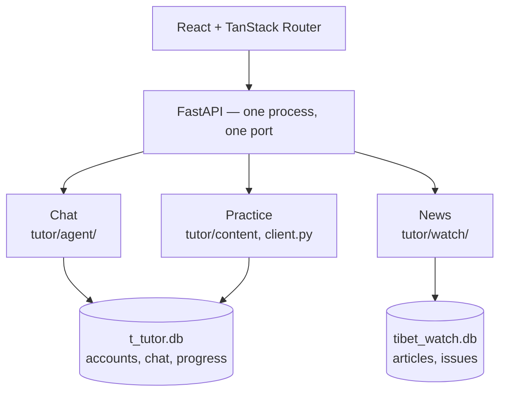
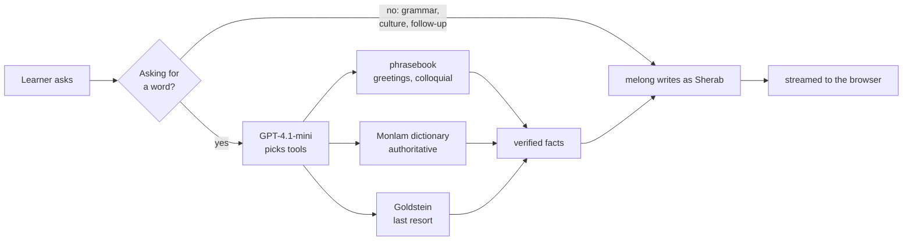
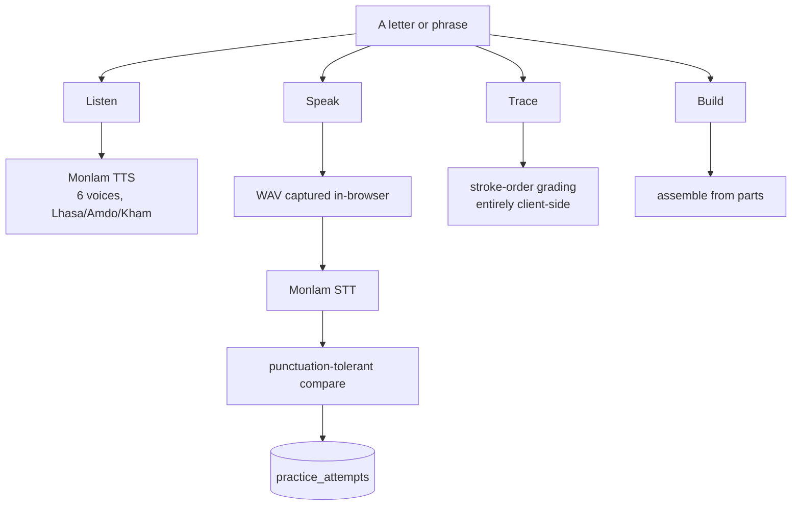
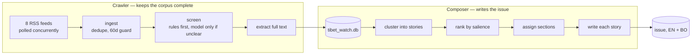

# MunSel

A Tibetan language app built on [Monlam AI](https://api-v1.monlamai.studio/docs).
Three products in one FastAPI process, sharing a database, an account and a
level.

| | What it does | What it runs on |
|---|---|---|
| **Chat** | Sherab, a tutor that looks vocabulary up before it teaches | GPT-4.1-mini orchestrates, melong writes |
| **Practice** | Alphabet and phrase drills — hear it, say it, write it | Monlam TTS and STT, client-side stroke grading |
| **News** | A bilingual Tibet newsletter, crawled and written by an agent | RSS + melong via LangChain |



Two databases on purpose: one holds irreplaceable user data, the other is a
cache the crawler can rebuild, and a crawl holds the SQLite writer for minutes
at a time.

## Running it locally

Needs Python 3.11+ and Node 22.

```bash
cp .env.example .env          # then fill in MONLAMAI_STUDIO and OPENAI_API_KEY

pip install -r t_tutor/requirements.txt
cd web && npm install
```

Two terminals, because the frontend wants hot reload:

```bash
cd t_tutor && python -m uvicorn app:app --reload --port 8080
cd web && npm run dev          # http://localhost:5173, proxies /api to :8080
```

Or the way production runs it — one port, no Node:

```bash
cd web && npm run build
cd t_tutor && python -m uvicorn app:app --port 8080   # http://localhost:8080
```

---

## Chat — Sherab, a tutor that looks things up

The tutor is called **Sherab**, and melong writes everything he says.

Melong writes fluent Tibetan but does not reliably *recall* it. Asked "how do
you say hello" during development it gave five different wrong answers, and
once answered "thank you" with the greeting.

So it never supplies vocabulary. A cheaper model gathers verified words with
tools first, and melong only explains what it was handed. **The model that
writes Tibetan does not decide what Tibetan is true.**

Worth being precise about the direction of trust, because it is the opposite
of the usual arrangement: melong is not a tool the orchestrator calls, and it
does not verify anything. It is the *least* trusted component here. Verification
happens before it runs, by looking words up in real sources; melong then writes
prose around facts it has been handed. Generation sits deliberately outside the
research loop — inside one, melong could be called mid-reasoning and its output
fed back as though it were evidence, which is the exact confusion this design
exists to prevent.



**The gate is deterministic, not model-decided.** Left to the orchestrator, a
question about grammar rules had it looking up the *words* "grammar" and
"unique" and teaching them as vocabulary; "what did you just teach me?" ran a
reverse lookup that returned an unrelated place name and overwrote a correct
pronunciation. A whitelist of phrasings that genuinely request a word is more
reliable than asking a model to judge its own confidence.

**Three sources, in priority order.** The phrasebook is 20 curated phrases and
6 colloquial words, and it exists because the Monlam dictionary returns
*nothing at all* for "hello" or "how are you", and literary register for
everyday adjectives — "beautiful" comes back as `བཀྲ་བ` ("shining,
variegated") where a beginner needed `མཛེས་པོ།`. The dictionary is
authoritative and free, ~250 ms. Goldstein is an OCR'd scan used only when both
miss, and labelled unreliable so the tutor hedges rather than asserts.

The loop is LangGraph: research, then generate, with generation deliberately
outside the loop. `TUTOR_AGENT=0` bypasses all of it and streams straight from
melong, which is a fast way to see why the layer exists.

`tutor/agent/` · orchestration `loop.py`, tools `tools.py`, generation `voice.py`

---

## Practice — hear it, say it, write it

Levels 1–5 decide which items appear. Each drill closes a different loop, and
they use different machinery.



**Speak needs its transcript normalised.** Monlam STT returns the right letters
with punctuation the speaker never said — `ཀ` comes back as `ཀ།`, `ང` as
`ང་།`. Comparing raw strings marks every correct answer wrong. Saying a
consonant aloud also produces a trailing vowel, so `ཀ` transcribes as `ཀའ` —
correct pronunciation that a naive match rejects. `tutor/normalize.py` forgives
an appended a-chung, but only when appended: stripping `འ` outright would erase
the twenty-third consonant, which is a practice item in its own right.

**Audio is captured as WAV, not the browser default.** `MediaRecorder` produces
webm/Opus; every verified STT call used WAV. The frontend collects raw PCM
through an `AudioContext` and encodes WAV itself.

**Trace is graded in the browser, stroke by stroke.** Writing the right shape
in the wrong order or direction is caught and named, which whole-shape
comparison cannot do. Glyphs without authored stroke data fall back to a
coverage check. No round trip, so feedback is immediate.

`tutor/content.py` items · `tutor/client.py` TTS/STT · `web/src/lib/stroke-grader.ts`

---

## News — a newsletter nobody writes

A crawler keeps a corpus complete; a separate agent turns a week of it into an
issue. Reading an issue touches no model at all — the work is already in
SQLite — so the News tab loads instantly and stays up when melong is throttled.



**RSS is a sliding window, not an archive.** CTA turns its entire feed over in
about 2.2 days, so a daily poll would lose stories permanently. Ingest also
refuses to filter on recency: a feed can be healthy and have nothing for a
week, and filtering at ingest would throw away exactly what an outage cost.

**Screening is two-stage because the stages cost differently.** A free
prefilter resolves most items — curated Tibet outlet in, veto list out, no
Tibet signal out. Only genuinely borderline items reach melong, batched fifteen
at a time, which is affordable because a binary judgement over a title and a
snippet is a much easier task than an open-ended one.

**The agent is LangChain's `create_agent` driving melong** through a
`ChatMelong` adapter, since melong has no native tool calling. Runs are
triggered from a button, password-gated — each one costs real money and takes
minutes. Progress streams as structured events, so the UI can show which outlet
is being read rather than a wall of log lines.

`tutor/watch/` · `crawler.py`, `relevance.py`, `compose.py`, `agent.py`

---

## Resources

A curated list of places to learn Tibetan elsewhere — books, video, courses,
dictionaries. Static data, no backend, nothing to rate-limit. Every link was
verified by fetching it rather than recalled, and each entry is tagged spoken
or literary, a distinction most directories skip and beginners lose months to.

`web/src/lib/resources-data.ts`

---

## Layout

```
t_tutor/                 the backend, and the only thing that runs in production
├── app.py               FastAPI: routes, SSE, serves web/dist
└── tutor/
    ├── agent/           chat: LangGraph research loop + melong
    ├── watch/           news: crawler, screening, composer, its own database
    ├── dictionary.py    Monlam dictionary API      ┐
    ├── phrasebook.py    curated phrases            ├ lookup sources
    ├── goldstein.py     OCR'd dictionary           ┘
    ├── client.py        Monlam: chat, TTS, STT, OCR
    ├── db.py            accounts, chat, practice attempts
    └── data/            phrases.json, goldstein_dict.jsonl, the Tibetan font

web/                     React + TanStack Router
tools/                   dict_scrapper.py — regenerates goldstein_dict.jsonl
docs/                    Monlam API reference
```

Dependencies point one way: `app.py → agent → tools → sources → network`. The
lookup sources import no LangChain, so "does the dictionary return ཐུགས་རྗེ་ཆེ།
for thank you" is testable without starting an agent.

Deeper notes, including the measurements behind these decisions, are in
[t_tutor/README.md](t_tutor/README.md) and
[t_tutor/tutor/watch/README.md](t_tutor/tutor/watch/README.md).

## What still needs a human

`t_tutor/tutor/data/phrases.json` — 20 phrases and 6 colloquial words the tutor
asserts as fact. It has not been reviewed by a native speaker, and an error
there reaches every learner.
